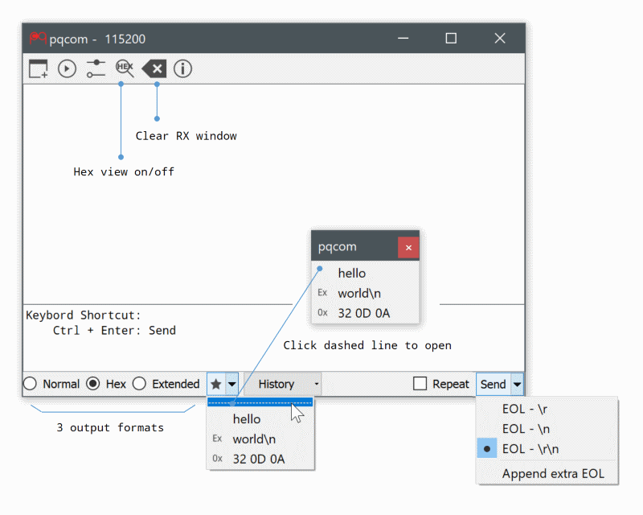

===========================================

[](https://ci.appveyor.com/project/xiongyihui/pqcom)

A simple serial port tool for Linux/Windows/Mac. It's written by Python and Qt (PySide).



### Features
+ auto-detect available serial ports
+ supports all baud rates
+ EOL (End Of Line) can be "\n", "\r", or "\r\n"
+ extra EOL can be appended
+ supports 3 output formats
  1. Normal
  2. Hex: Hex data will be converted
  3. Extend: `\t`, `\r` and `\n` are escape characters, each of them is a single character
+ supports 2 display formats
  1. Normal
  2. Hex: left part displays hex string, right part displays normal string
+ frequently used strings can be saved
+ history is included
+ data can be sent repeatedly
+ keyboard shortcut ctrl + enter to send


```
+------------------------------------------------------------------+
|                         pqcom                              - + x |
+------------------------------------------------------------------+
| + | > | = | H | X | i |                                          |
+------------------------------------------------------------------+
| |   |   |   |   |   |                                            |
| |   |   |   |   |   +---> Open about dialog                      |
| |   |   |   |   |                                                |
| |   |   |   |   +-------> Clear received message                 |
| |   |   |   |                                                    |
| |   |   |   +-----------> Enable/Disable Hex View                |
| |   |   |                                                        |
| |   |   +---------------> Open settings dialog                   |
| |   |                                                            |
| |   +-------------------> Open/Close serial port                 |
| |                                                                |
| +-----------------------> Open a new window                      |
|                                                                  |
|                                                                  |
|                                                                  |
|                                                                  |
|                                                                  |
|                                                                  |
+------------------------------------------------------------------+
|                                                                  |
|  Keyboard Shortcut                                               |
|      Ctrl + Enter: Send                                          |
|                                                                  |
+------------------------------------------------------------------+
| + Normal | O Hex | O Extended | * | History |  | # Repeat | Send |
+------------------------------------------------------------------+

```

### Requirements

-	python
-	pyserial
-	pyside

### Installation

-	Linux/Mac

	1. install pyside
	2. use pip to install pqcom - `pip install pqcom`


-	Windows

	Download it from [Google Drive](https://drive.google.com/open?id=0BwQmZU7Kqh7RR3JCRWUzLWhlb28) or [Baidu Pan](http://pan.baidu.com/s/1ski1RUt).

The icons are from [KDE Plasma Breeze Icons](https://github.com/NitruxSA/plasma-next-icons/)
